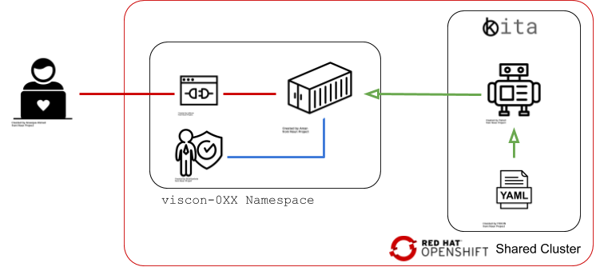

## MY OWN CUSTOM<br/>KAFKA CLUSTER 
#### IN 60 SECONDS
  
<br/>
<br/>


#### Innovation Process Technology AG
##### Daniel Strebel & Jonathan Gan

---

## Welcome

<div></div>

<div></div>

---

## whois [ipt.ch](https://ipt.ch)

```sh
This information is subject to an Acceptable Use Policy.
See https://www.nic.ch/terms/aup/


Domain name:
ipt.ch

Holder of domain name:
Innovation Process Technology Inc.
Thomas Schaller
Poststrasse 14
CH-6300 Zug
Switzerland

Technical contact:
Comfox AG
Martin Fuchs
Bösch 82
CH-6331 Hünenberg
Switzerland

Registrar:
METANET AG

First registration date:
1997-02-25

DNSSEC:N

Name servers:
ch.ch-inter.net
de.ch-inter.net
nl.ch-inter.net
```

<div></div>

---

## ipt AG @ ERFA

<div></div>

<div></div>

---

## whoami #Daniel


<!-- https://emojipedia.org -->
* 🇨🇭 Born in Zurich
* 🤓 Computer Science Masters UZH
* 🧳 Analytics, Corporate R&D, Innovation Labs
* 🚀 Cloud Architecture, Data, ML
* 💙 Running, Hiking, Travel

<div></div>

---

## whoami #Jonathan

<!-- https://emojipedia.org -->
* 🇸🇬 Born in Singapore
* 🤓 Robotics Masters ETH
* 🧳 {Disney, IBM} Research
* 🚀 Computer Vision, ML, DevOps
* 💙 Music, Cooking, Gym

<div></div>

---

## Kubernetes in a Nutshell

<div></div>

<div></div>

---

## From Bare Metal to Container Orchestration


---

## k8s Lingo

* Pod
* Container
* Deployment
* Service
* Route
* Serviceaccount

<div></div>

---

## Intro to the Lab Environment

The high level picture



<div></div>

---

## Rule 1/1: Stick to the Instructions


---

## 🙌 Play with your Workspace

Visit the URL on your snippet and enter the password to access the workspace


<div></div>

---

## 🙌 Prepare your Shell


<div></div>

---

## 🙌 Openshift CLI

Download and install the OC CLI

```bash
source ./kita-oc-cli/install.sh
```

Try a few things

```bash
oc whoami

oc get all
```

<div></div>

---

## Apache Kafka


<div class="tiny">© ipt AG</div>

<div></div>

---

## Kafka High-Level


<div class="tiny">© ipt AG</div>

<div></div>

---

## Kafka Secret Sauce


<div class="tiny">© ipt AG</div>

<div></div>

---

## What is Strimzi
<div>

</div>

* [Open Source](https://github.com/strimzi) Project (started by Red Hat)
* Recencly adopted as a [CNCF](https://www.cncf.io/) Project
* Using Operators to deploy and manage Apache Kafka on Kubernetes / Openshift
* Used by ipt in production since GA in 2018


<div></div>

---

## Strimzi Components


<div></div>

---

## Strimzi Installation

What has been done for you  
(because it requires cluster admin rights)

##### Custom Resource Definitions

```bash
oc get CustomResourceDefinitions | grep kafka


kafkas.kafka.strimzi.io
kafkatopics.kafka.strimzi.io
kafkausers.kafka.strimzi.io
```

<div></div>

---

## Strimzi Installation Cont.

What has been done for you  
(because it requires cluster admin rights)


##### Roles and ClusterRoles

```bash
oc get ClusterRoles | grep strimzi

NAME
strimzi-cluster-operator-global
strimzi-cluster-operator-namespaced
strimzi-entity-operator
strimzi-kafka-broker
strimzi-topic-operator
```

And assigned them to the `strimzi-cluster-operator` service account as well as your "user"

<div></div>

---

## 🙌 Setting up the cluster

Change into the tutorial project

```bash
cd /home/coder/projects/viscon-strimzi
```

<div></div>

---

## 🙌 Strimzi Custom Resource

```yaml
apiVersion: kafka.strimzi.io/v1beta1
kind: Kafka
metadata:
  name: viscon-cluster
spec:
  kafka:
    version: 2.3.0
    replicas: 3
    listeners:
      plain: {}
      tls: {}
    config:
      #...
    storage:
      type: ephemeral
  zookeeper:
    replicas: 1
    storage:
      type: ephemeral
  entityOperator:
    topicOperator: {}
    userOperator: {}

```

see `./strimzi/kafka/kafka-plain.yaml`

<div></div>


---

## 🙌 Strimzi Operator Deployment

First, we deploy the strimzi operator

```bash
oc apply -f strimzi/deployment-strimzi-operator.yaml
```

and wait until it is ready

```bash
oc get pod -l name=strimzi-cluster-operator
NAME                                        READY     STATUS    RESTARTS   AGE
strimzi-cluster-operator-6bfb66c5f7-n7qr2   1/1       Running   0          34s
```
we can also inspect its logs by running

```bash
oc logs -f $(oc get pod -l name=strimzi-cluster-operator -o name)
```

<div></div>

---

## 🙌 Kafka Cluster Deployment

Create a custom Kafka resource
```bash
oc apply -f strimzi/kafka/kafka-plain.yaml
```

Watch the operator create a full Kafka cluster  
(in about 40s 🎉)

```bash
oc get pods

NAME                                              READY     STATUS
strimzi-cluster-operator-6bfb66c5f7-n7qr2         1/1       Running
viscon-cluster-entity-operator-6cbbd888bc-hn9fm   3/3       Running
viscon-cluster-kafka-0                            2/2       Running
viscon-cluster-kafka-1                            2/2       Running
viscon-cluster-zookeeper-0                        2/2       Running
```

<div></div>

---

## First End To End Example

Start simple producers and consumers to  
write to and read from a Kafka topic.

<div></div>

<div></div>

---

## 🙌 First Kafka Producer

Start a console producer pod

```bash
oc run kafka-producer -ti --image=strimzi/kafka:0.14.0-kafka-2.3.0 \
 --rm=true --restart=Never -- bin/kafka-console-producer.sh \
 --broker-list viscon-cluster-kafka-bootstrap:9092 \
 --topic viscon-console-demo
```

and produce a few messages

```bash
If you don`t see a command prompt, try pressing enter.
>Hello Viscon
>2nd hello  
>3rd hello
```

Kill the session with CTRL + C when done

<div></div>

---

## 🙌 First Kafka Consumer

Start a console consumer pod

```bash
oc run kafka-consumer -ti --image=strimzi/kafka:0.14.0-kafka-2.3.0 \
 --rm=true --restart=Never -- bin/kafka-console-consumer.sh \
 --bootstrap-server viscon-cluster-kafka-bootstrap:9092 \
 --topic viscon-console-demo --from-beginning
```

and receive the previously produced messages
```bash
If you don`t see a command prompt, try pressing enter.
Hello Viscon
2nd hello
3rd hello
```

Kill the session with CTRL + C when done

<div></div>

---

## 🙌 Explore Kafka Topics

Explore the Topics within Kafka

```bash
oc run kafka-topic-list -ti --image=strimzi/kafka:0.14.0-kafka-2.3.0 \
--rm=true --restart=Never -- bin/kafka-topics.sh --list \
--bootstrap-server viscon-cluster-kafka-bootstrap:9092

__consumer_offsets
viscon-console-demo
pod "kafka-topic-list" deleted
```

And the generated KafkaTopic Resources

```bash
oc get KafkaTopics

NAME                                                          PARTITIONS   REPLICATION FACTOR
consumer-offsets---84e7a678d08f4bd226872e5cdd4eb527fadc1c6a   50           2
viscon-console-demo                                           1            1
```

<div></div>

---

## 🙌 Kafka Topic - Spec First

Take a look at the KafkaTopic in  
`strimzi/console-demo/topic.yaml`

```yaml
apiVersion: kafka.strimzi.io/v1beta1
kind: KafkaTopic
metadata:
  name: viscon-topic
  labels:
    strimzi.io/cluster: viscon-cluster
spec:
  partitions: 6
  replicas: 2
  config:
    retention.ms: 86400000 #24h
```

Now, create the topic by applying the CR

```bash
oc apply -f strimzi/console-demo/topic.yaml
```

<div></div>


---

## 🙌 Kafka Topic - Operator Magic

Let's look at the Entity Operator Logs

```bash
oc logs -f $(oc get pods -l strimzi.io/name=viscon-cluster-entity-operator -o name) -c topic-operator
```

And the Kafka internal Topic List

```bash
oc run kafka-topic-list -ti --image=strimzi/kafka:0.14.0-kafka-2.3.0 \
 --rm=true --restart=Never -- bin/kafka-topics.sh --list \
 --bootstrap-server viscon-cluster-kafka-bootstrap:9092

__consumer_offsets
viscon-topic
viscon-console-demo
pod "kafka-topic-list" deleted
```

<div></div>

---

## That was cute?!

So what is missing?

# 🤷

* Authentication
* Processing
* Metrics


<div></div>

---

## 🙌 Kafka Authentication

We no longer want our topics to be open to the world.

We can enforce [mutual tls](https://en.wikipedia.org/wiki/Mutual_authentication)  
by adapting our Kafka resource:

```bash
diff strimzi/kafka/kafka-plain.yaml strimzi/kafka/kafka-mtls.yaml
10,11c10,12
<       plain: {}
<       tls: {}
---
>       tls:
>         authentication:
>           type: tls
```

<div></div>


---

## 🙌 Kafka Authentication Cont.

To change the broker listener config we apply the  
`strimzi/kafka/kafka-mtls.yaml`  
config.

```bash
oc apply -f strimzi/kafka/kafka-mtls.yaml
```

and wait for the Kafka brokers to update

<div></div>

---

## More Sophisticated Scenario


<div></div>

<div></div>

---

## 🙌 Create Demo Producer User

`strimzi/iot-demo/iot-device/users.yaml`

```yaml
apiVersion: kafka.strimzi.io/v1beta1
kind: KafkaUser
metadata:
  name: iot-device
  labels:
    app: iot-demo
    strimzi.io/cluster: viscon-cluster
spec:
  authentication:
    type: tls
  authorization:
    type: simple
    acls:
      - resource:
          type: topic
          name: iot-temperature
          patternType: literal
        operation: Write
        host: "*"
      - resource:
          type: topic
          name: iot-temperature
          patternType: literal
        operation: Describe
        host: "*"
      - resource:
          type: topic
          name: iot-temperature
          patternType: literal
        operation: Create
        host: "*"
```

<div></div>

---

## 🙌 Create Demo Stream User

`strimzi/iot-demo/iot-stream/users.yaml`

```yaml
apiVersion: kafka.strimzi.io/v1beta1
kind: KafkaUser
metadata:
  name: iot-stream
  labels:
    app: iot-demo
    strimzi.io/cluster: viscon-cluster
spec:
  authentication:
    type: tls
  authorization:
    type: simple
    acls:
      - resource:
          type: topic
          name: iot-temperature
          patternType: literal
        operation: Read
        host: "*"
      - resource:
          type: topic
          name: iot-temperature-max
          patternType: literal
        operation: Write
        host: "*"
      - resource:
          type: topic
          name: iot-temperature
          patternType: literal
        operation: Describe
        host: "*"
      - resource:
          type: topic
          name: iot-temperature-max
          patternType: literal
        operation: Describe
        host: "*"
      - resource:
          type: topic
          name: iot-temperature-max
          patternType: literal
        operation: Create
        host: "*"
      - resource:
          type: group
          name: iot-streams-app
          patternType: prefix
        operation: Read
        host: "*"

```

<div></div>


---

## 🙌 Create Demo Consumer User

`strimzi/iot-demo/iot-consumer/users.yaml`

```yaml
apiVersion: kafka.strimzi.io/v1beta1
kind: KafkaUser
metadata:
  name: iot-consumer
  labels:
    app: iot-demo
    strimzi.io/cluster: viscon-cluster
spec:
  authentication:
    type: tls
  authorization:
    type: simple
    acls:
      - resource:
          type: topic
          name: iot-temperature-max
          patternType: literal
        operation: Read
        host: "*"
      - resource:
          type: topic
          name: iot-temperature-max
          patternType: literal
        operation: Describe
        host: "*"
      - resource:
          type: group
          name: iot-consumers
          patternType: prefix
        operation: Read
        host: "*"

```

<div></div>

---

## 🙌 Create all Users


```bash
oc apply -f strimzi/iot-demo/iot-device/users.yaml
oc apply -f strimzi/iot-demo/iot-stream/users.yaml
oc apply -f strimzi/iot-demo/iot-consumer/users.yaml
```

Verify the ACL for `iot-temperature`

```bash
oc exec viscon-cluster-zookeeper-0 -c zookeeper -- /opt/kafka/bin/kafka-acls.sh \
--authorizer-properties zookeeper.connect=localhost:21810  \
--list --topic iot-temperature
```

and for `iot-temperature-max`

```bash
oc exec viscon-cluster-zookeeper-0 -c zookeeper -- /opt/kafka/bin/kafka-acls.sh \
--authorizer-properties zookeeper.connect=localhost:21810  \
--list --topic iot-temperature-max
```

<div></div>

---

## 🙌 Kafka User Secrets

The entity operator created user certificates for all users which include a CA certificate, a public certificate and a private key.


```bash
oc get secrets -l strimzi.io/kind=KafkaUser -o yaml
```

<div></div>

---

## 🙌 Mounting User Secrets

E.g. `strimzi/iot-demo/iot-device/deployment.yaml`  
  
```yaml
containers:
  - name: device-app
    image: danistrebel/strimzi-device-app:latest
    env:
      - name: USER_CRT
        valueFrom:
          secretKeyRef:
            name: iot-device
            key: user.crt
      - name: USER_KEY
        valueFrom:
          secretKeyRef:
            name: iot-device
            key: user.key
```

<div></div>

---

## 🙌 Deploy the IoT Device

```bash
oc apply -f strimzi/iot-demo/iot-device/deployment.yaml
```

and check the logs

```bash
oc logs -f $(oc get pod -l name=device-app -o name | head -n 1)
```

Full Code  

[https://github.com/danistrebel/strimzi-lab](https://github.com/danistrebel/strimzi-lab/tree/master/iot-demo/device-app)


<div></div>


---

## 🙌 Deploy the IoT Stream Processor

```bash
oc apply -f strimzi/iot-demo/iot-stream/deployment.yaml
```

and check the logs

```bash
oc logs -f $(oc get pod -l name=stream-app -o name | head -n 1)
```

Full Code  

[https://github.com/danistrebel/strimzi-lab](https://github.com/danistrebel/strimzi-lab/tree/master/iot-demo/stream-app)


<div></div>

---

## 🙌 Deploy the Consumer

```bash
oc apply -f strimzi/iot-demo/iot-consumer/deployment.yaml
```

and check the logs

```bash
oc logs -f $(oc get pod -l name=consumer-app -o name | head -n 1)
```

Full Code  

[https://github.com/danistrebel/strimzi-lab](https://github.com/danistrebel/strimzi-lab/tree/master/iot-demo/consumer-app)

<div></div>

---

## 🙌 Check the Dashboard

```bash
oc get route consumer-app -o jsonpath='{.spec.host}'
```

and open it in a new Tab

<div></div>

<div></div>

---

## 🙌 Scale the Deployment

Increase the number of sensor devices to 3

```bash
oc scale deployment device-app --replicas 3
```

and wait for the data to show up in the dashboard

<div></div>

<div></div>

---

## 🙌 Cluster Monitoring

Create a scrape config

```bash
oc create secret generic additional-scrape-configs --from-file=strimzi/metrics-demo/prometheus-additional.yaml
```

and the Prometheus deployment

```bash
oc apply -f strimzi/metrics-demo/prometheus.yaml

oc apply -f strimzi/metrics-demo/prometheus-service-monitor.yaml
```

<div></div>

---

## 🙌 Check the Prometheus Targets

```bash
oc get route prometheus
```

<div></div>


<div></div>

---

## 🙌 Deploy Grafana

```bash
oc apply -f strimzi/metrics-demo/grafana.yaml 
oc get routes grafana
```

<div></div>

user: admin, password: admin

<div></div>

---

## 🙌 Configure the Prometheus Datasource

<div></div>

Name: Prometheus, Url: http://prometheus:9090

<div></div>

---

## 🙌 Import the Strimzi Dashboard

Copy `strimzi/metrics-demo/kafka-dashboard.json`

<div></div>

<div></div>

---

### Kafka Eco System

* Kafka Connect
* Mirror Maker
* HTTP Bridge
* Managed Kafka
  * AWS MSK
  * Azure Eventhubs
  * Confluent on GCP... 


<div></div>

---

## Fireside Chat / Q&A


<div></div>

---

## Contacts and Info

* **Daniel Strebel**  
  Email: daniel.strebel@ipt.ch  
  Linkedin: linkedin.com/in/danistrebel

* **Jonathan Gan**  
  Email: jonathan.gan@ipt.ch  
  Linkedin: linkedin.com/in/jonganej

* **IPT Careers Portal**  
  ipt.ch/karriere

<div></div>
