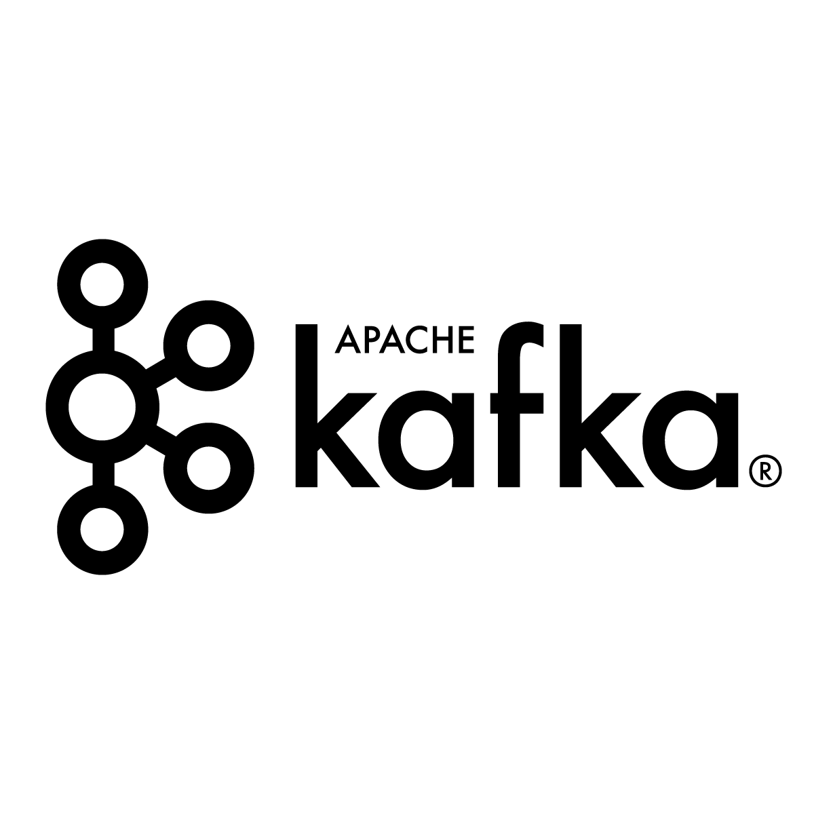

## MY OWN CUSTOM<br/>KAFKA CLUSTER 
#### IN 60 SECONDS
  
<br/>
<br/>


#### Innovation Process Technology AG
##### Daniel Strebel & Jonathan Gan

---

## whois ipt.ch

TODO here

<div></div>

---

## whoami #Daniel


<!-- https://emojipedia.org -->
* 🇨🇭 Born in Zurich
* 🤓 Computer Science Masters UZH
* 🧳 Data Analytics, Corporate R&D, Innovation Labs
* 🚀 Cloud, Data, AI
* 💙 Running, Hiking, Travel

<div></div>

---

## whoami #Jonathan

<!-- https://emojipedia.org -->
* 🇸🇬 Born in Singapore
* 🤓 Robotics Masters ETH
* 🧳 {Disney, IBM} Research
* 🚀 Computer Vision, ML, DevOps
* 💙 Music, Cooking, Gym

<div></div>

---

## Kubernetes in a Oneliner

Going from *it works on my com* to 

*it works predictably across a cluster of machines*

<div></div>

---

## From Bare Metal to Container Orchestration


<div></div>

---

## Intro to the Lab Environment

TODO Introduce Kita

<div></div>

---

## 🙌 Play with your Workspace

Visit the URL on your snippet and enter the password to access the workspace


<div></div>

---

## 🙌 Prepare your Shell


<div></div>

---

## 🙌 Openshift CLI

Download and install the OC CLI

```bash
source ./kita-oc-cli/install.sh
```

Try a few things

```bash
oc whoami

oc get all
```

<div></div>

---

## What is Apache Kafka



<div></div>

---

## What is Strimzi
<div>

</div>

* Started by Redhat
* Now CNCF Project
* Using Operators to deploy and manage Apache Kafka on Kubernetes / Openshift
* Used by ipt in production since 2018


<div></div>

---

## Strimzi Installation

What has been done for you  
(because it requires cluster admin rights)

###### Created Custom Resource Definitions 
```bash
oc get customresourcedefinitions
NAME
kafkas.kafka.strimzi.io
kafkatopics.kafka.strimzi.io
kafkausers.kafka.strimzi.io
# and some more
```

<div></div>

---

## Strimzi Installation Cont.

What has been done for you  
(because it requires cluster admin rights)


###### Created Roles and ClusterRoles

```bash
oc get clusterroles
NAME
strimzi-cluster-operator-global
strimzi-cluster-operator-namespaced
strimzi-entity-operator
strimzi-kafka-broker
strimzi-topic-operator
```

And assigned them to the `strimzi-cluster-operator` service account as well as your "user"

<div></div>

---

## Strimzi Components


<div></div>


---

## 🙌 Strimzi Custom Resource

```yaml
apiVersion: kafka.strimzi.io/v1beta1
kind: Kafka
metadata:
  name: viscon-cluster
spec:
  kafka:
    version: 2.3.0
    replicas: 3
    listeners:
      plain: {}
      tls: {}
    config:
      #...
    storage:
      type: ephemeral
  zookeeper:
    replicas: 1
    storage:
      type: ephemeral
  entityOperator:
    topicOperator: {}
    userOperator: {}

```

see `./strimzi/kafka0.yaml` for the full file

<div></div>


---

## 🙌 Strimzi Operator Deployment

First, we deploy the strimzi operator

```bash
oc apply -f strimzi/deployment-strimzi-operator.yaml
```

and wait until it is ready

```bash
oc get pod -l name=strimzi-cluster-operator
NAME                                        READY     STATUS    RESTARTS   AGE
strimzi-cluster-operator-6bfb66c5f7-n7qr2   1/1       Running   0          34s
```
we can also inspect its logs by running

```bash
oc logs -f $(oc get pod -l name=strimzi-cluster-operator -o name)
```

<div></div>

---

## 🙌 Kafka Cluster Deployment

Create a custom Kafka resource
```bash
oc apply -f strimzi/kafka0.yaml
```

Watch the operator create a full Kafka cluster

```bash
oc get pods

NAME                                              READY     STATUS
strimzi-cluster-operator-6bfb66c5f7-n7qr2         1/1       Running
viscon-cluster-entity-operator-6cbbd888bc-hn9fm   3/3       Running
viscon-cluster-kafka-0                            2/2       Running
viscon-cluster-kafka-1                            2/2       Running
viscon-cluster-zookeeper-0                        2/2       Running
```

<div></div>

---

## 🙌 First Kafka Producer

Start a console producer pod

```bash
oc run kafka-producer -ti --image=strimzi/kafka:0.14.0-kafka-2.3.0 \
 --rm=true --restart=Never -- bin/kafka-console-producer.sh \
 --broker-list viscon-cluster-kafka-bootstrap:9092 \
 --topic viscon-console-demo
```

and produce a few messages

```bash
If you don`t see a command prompt, try pressing enter.
>Hello Viscon
>2nd hello  
>3rd hello
```

Kill the session with CTRL + C when done

<div></div>

---

## 🙌 First Kafka Consumer

Start a console consumer pod

```bash
oc run kafka-consumer -ti --image=strimzi/kafka:0.14.0-kafka-2.3.0 \
 --rm=true --restart=Never -- bin/kafka-console-consumer.sh \
 --bootstrap-server viscon-cluster-kafka-bootstrap:9092 \
 --topic viscon-console-demo --from-beginning
```

and receive the previously produced messages
```bash
If you don`t see a command prompt, try pressing enter.
Hello Viscon
2nd hello
3rd hello
```

Kill the session with CTRL + C when done

<div></div>

---

## 🙌 Explore Kafka Topics

Explore the Topics within Kafka

```bash
oc run kafka-topic-list -ti --image=strimzi/kafka:0.14.0-kafka-2.3.0 \
--rm=true --restart=Never -- bin/kafka-topics.sh --list \
--bootstrap-server viscon-cluster-kafka-bootstrap:9092

__consumer_offsets
viscon-console-demo
pod "kafka-topic-list" deleted
```

And the generated KafkaTopic Resources

```bash
oc get KafkaTopics   

NAME                                                          PARTITIONS   REPLICATION FACTOR
consumer-offsets---84e7a678d08f4bd226872e5cdd4eb527fadc1c6a   50           2
viscon-console-demo                                           1            1
```

<div></div>

---

## 🙌 Kafka Topic - Spec First

Take a look at the KafkaTopic in `strimzi/topic0.yaml`

```
apiVersion: kafka.strimzi.io/v1beta1
kind: KafkaTopic
metadata:
  name: viscon-auth
  labels:
    strimzi.io/cluster: viscon-cluster
spec:
  partitions: 6
  replicas: 2
  config:
    retention.ms: 7200000
    segment.bytes: 1073741824
```

Now, create the topic by applying the CR

```bash
oc apply -f strimzi/topic0.yaml
```

<div></div>


---

## 🙌 Kafka Topic - Operator Magic

Let's look at the Entity Operator Logs

```bash
oc logs -f $(oc get pods -l strimzi.io/name=viscon-cluster-entity-operator -o name) -c topic-operator
```

And the Kafka internal Topic List

```bash
oc run kafka-topic-list -ti --image=strimzi/kafka:0.14.0-kafka-2.3.0 \
 --rm=true --restart=Never -- bin/kafka-topics.sh --list \
 --bootstrap-server viscon-cluster-kafka-bootstrap:9092

__consumer_offsets
viscon-auth
viscon-console-demo
pod "kafka-topic-list" deleted
```

<div></div>

---

## 🙌 Kafka Authentication

Because we no longer want the whole world to be able to read and write to and from our Kafka Topics we change our Kafka Resource

```bash
diff strimzi/kafka0.yaml strimzi/kafka1.yaml
10,11c10,12
<       plain: {}
<       tls: {}
---
>       tls:
>         authentication:
>           type: tls
```

<div></div>


---

## 🙌 Kafka Authentication Cont.

To change the listener config we apply the `./strimzi/kafka0.yaml`  config.

```bash
oc apply -f strimzi/kafka1.yaml
```

<div></div>

---

## 🙌 Kafka Consumer User

Create Users with Read/Write Permissions

`./strimzi/user-consumer0.yaml`

```yaml
apiVersion: kafka.strimzi.io/v1beta1
kind: KafkaUser
metadata:
  name: consumer-0
  labels:
    strimzi.io/cluster: viscon-cluster
spec:
  authentication:
    type: tls
  authorization:
    type: simple
    acls:
      - resource:
          type: topic
          name: viscon-auth
          patternType: literal
        operation: Read
        host: "*"
      - resource:
          type: topic
          name: viscon-auth
          patternType: literal
        operation: Describe
        host: "*"
      - resource:
          type: group
          name: consumer-group
          patternType: literal
        operation: Read
        host: "*"
```
<div></div>


---

## 🙌 Kafka Producer User


`./strimzi/user-producer0.yaml`

```yaml
apiVersion: kafka.strimzi.io/v1beta1
kind: KafkaUser
metadata:
  name: producer-0
  labels:
    strimzi.io/cluster: viscon-cluster
spec:
  authentication:
    type: tls
  authorization:
    type: simple
    acls:
      - resource:
          type: topic
          name: viscon-auth
          patternType: literal
        operation: Write
        host: "*"
      - resource:
          type: topic
          name: viscon-auth
          patternType: literal
        operation: Create
        host: "*"
      - resource:
          type: topic
          name: viscon-auth
          patternType: literal
        operation: Describe
        host: "*"
```
<div></div>


---

## 🙌 Kafka Producer User


Create both users
```bash
oc apply -f strimzi/user-consumer0.yaml

oc apply -f strimzi/user-producer0.yaml
```

Verify that the Entity Operator  
correctly configured the ACL

```bash
oc exec viscon-cluster-zookeeper-0 -- /opt/kafka/bin/kafka-acls.sh \
--authorizer-properties zookeeper.connect=localhost:21810  \
--list --topic viscon-auth
```

<div></div>

---

## 🙌 Kafka User Secrets

The entity operator created user certificates for all users which include a CA certificate, a public certificate and a private key.


```bash
oc get secrets -l strimzi.io/kind=KafkaUser -o yaml
```

<div></div>

---

## Need to demonstrate the Auth Demo

https://github.com/strimzi/client-examples/blob/master/deployment-ssl-auth.yaml

---

## Contacts and Info

* **Daniel Strebel**  
  Email: daniel.strebel@ipt.ch  
  Linkedin: linkedin.com/in/danistrebel

* **Jonathan Gan**  
  Email: jonathan.gan@ipt.ch  
  Linkedin: linkedin.com/in/jonganej

* **IPT Careers Portal**  
  ipt.ch/karriere

<div></div>
